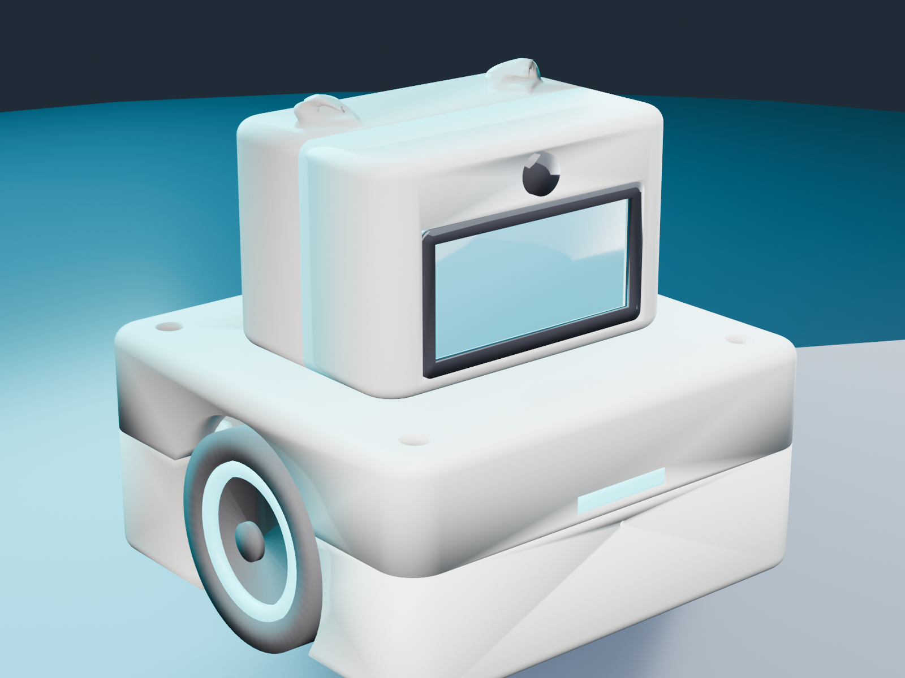
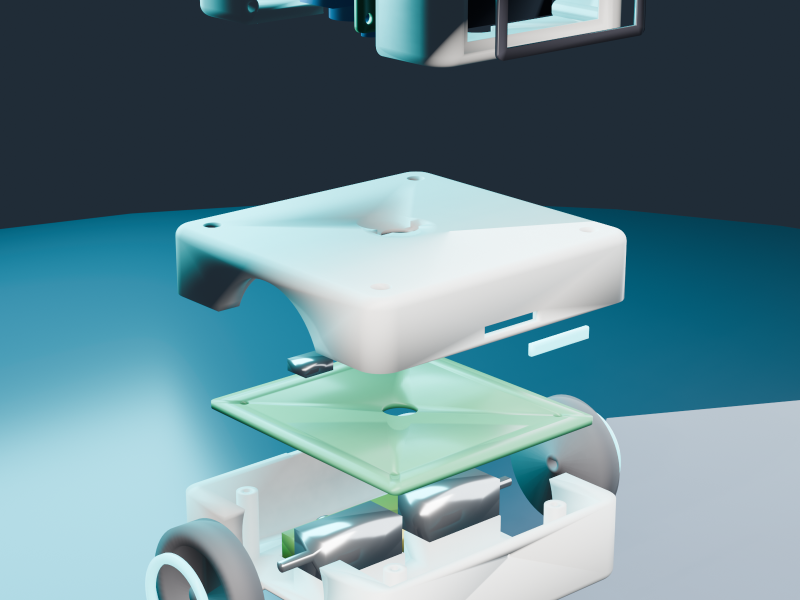
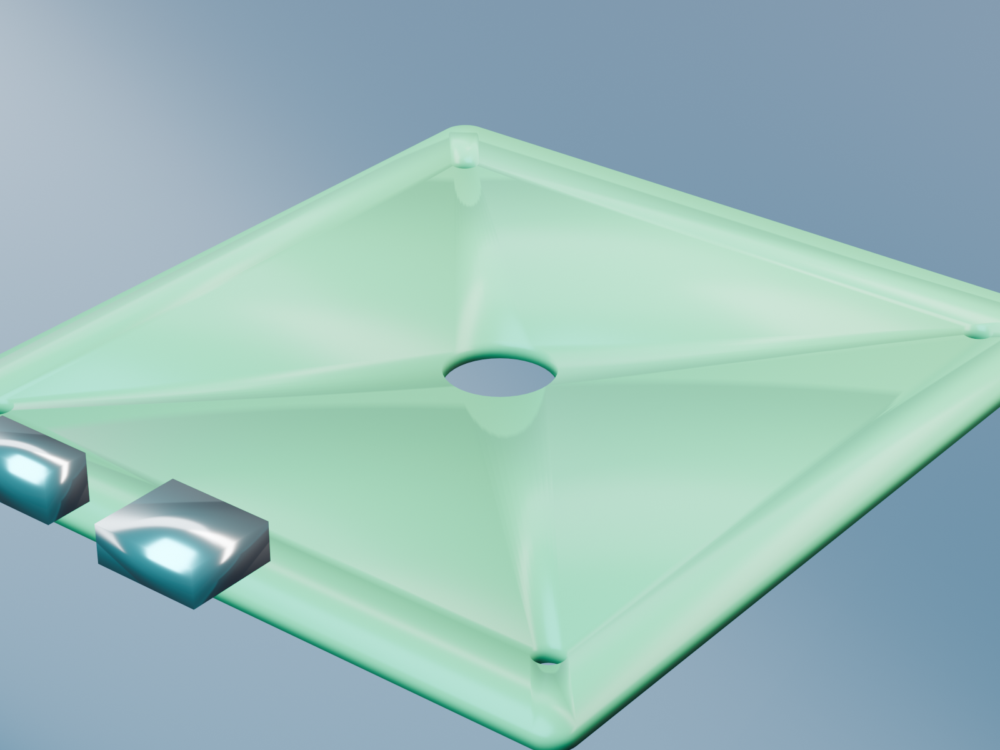
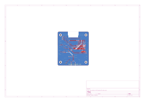
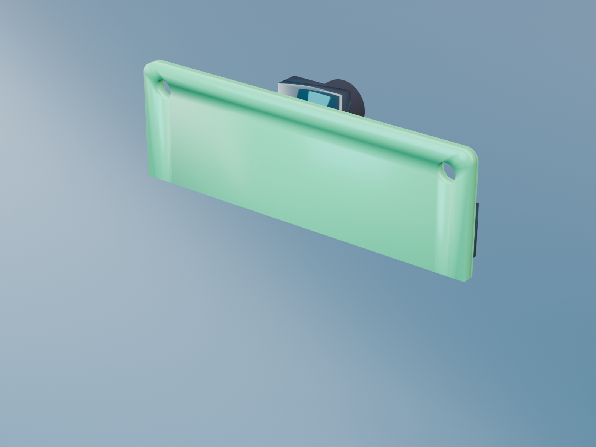
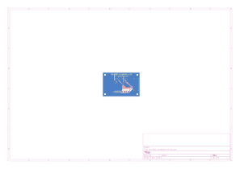
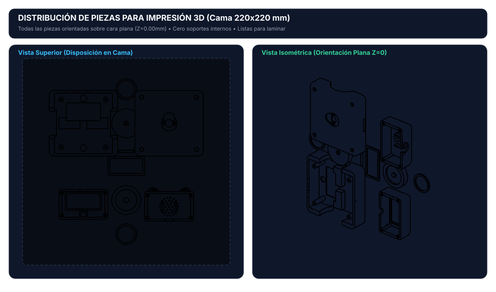
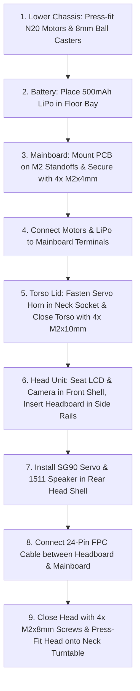

# FOCUSBOT: Open-Source Autonomous AI Desktop Companion Robot

<p align="center">
  
</p>

<p align="center">
  <a href="https://ohwr.org/cern_ohl_s_v2.txt"></a>
  <a href="LICENSE"></a>
  
  <a href="https://www.freecad.org/"></a>
  <a href="https://www.kicad.org/"></a>
  <a href="https://www.espressif.com/"></a>
</p>

---

## 📖 Overview

**FocusBot** is an ultra-compact, expressive, open-source desktop AI companion robot engineered for productivity, computer vision, focus coaching, and interactive robotics research. Built from the ground up under strict industrial mechatronic design standards (*Physics-First, Holistic DFA/DFM, Zero-Collision OCC Solid Geometry*), FocusBot fits full autonomous spatial locomotion, computer vision, two-way audio, and expressive screen feedback into an ultra-portable **8.0 cm** form factor.

FocusBot is **100% Open Source Hardware & Software**, designed for accessible manufacturing via standard consumer 3D printers (FDM/SLA) and 2-layer standard PCB fabrication (JLCPCB, PCBWay, etc.).

---

## 📐 Mechanical Architecture & DFA Top-Down Assembly

FocusBot features a custom **Top-Down DFA (Design for Assembly)** monocoque architecture engineered in FreeCAD with parametric Open CASCADE solid modeling:

<p align="center">
  
</p>

<p align="center">
  
</p>

### Key Enclosure Features:
- **Top-Down Serviceability**: The torso is split horizontally at $Z = 24.5\text{ mm}$ into a lower chassis tub (`Carcasa_Torso_Chasis`) and an upper hood (`Carcasa_Torso_Tapa`). Technicians can populate motors, battery, casters, and wire the Mainboard PCB with complete top-down clearance before sealing the assembly with 4 vertical corner M2 fasteners.
- **Biomorphic Head Unit**: Integrates a flush-mounted 2.0" IPS display, coaxial OV2640 camera aperture, acoustic 37-hole tuned speaker grille, integrated expressive ears, and 4 rear counterbored M2 screw sockets accessible from the exterior.
- **Kinematic Ground Plane ($Z = 0.00\text{ mm}$)**: 4-point coplanar ground contact consisting of two $\varnothing 34.0\text{ mm}$ smooth cylindrical traction wheels ($R = 17.00\text{ mm}$) and two precision $\varnothing 8.0\text{ mm}$ omnidirectional stainless steel ball casters, guaranteeing zero-wobble differential steering.
- **Zero Collision Guarantee**: 100% verified via boolean intersection algorithms across all 22 components ($0.0000\text{ mm}^3$ mutual collision).

---

## ⚡ Electrical Architecture & PCB Engineering

The robot is powered by a modular two-board architecture communicating through a 24-conductor, 0.5 mm pitch flexible flat cable (FFC/FPC) with locking ZIF connectors:

### 1. Mainboard PCB (`64.0 x 70.0 mm`, 2-Layer FR4)
Acts as the central power, locomotion, and processing hub located in the lower chassis.

<p align="center">
  
</p>

<p align="center">
  
</p>

- **Microcontroller**: ESP32-S3-WROOM-1 (Dual-core 240 MHz Xtensa LX7, 16 MB Flash, 8 MB PSRAM, Wi-Fi 4, BLE 5.0).
- **Power Subsystem**: Single-cell LiPo 3.7V / 500mAh battery, integrated TP4056 linear charger with USB-C 16-pin interface, reverse protection, and high-PSRR AP2112K-3.3 LDO (600 mA).
- **Motor Control**: Texas Instruments DRV8833 dual H-bridge motor driver with current-limiting sense resistors, driving two N20 micro metal gearmotors (PWM control, forward/reverse/brake).
- **Expansion & Diagnostics**: USB-C Native D+/D- USB serial/JTAG for high-speed flashing and debugging, dedicated SW1 power slide switch, and RGB status chest indicators.
- **Routing & Signal Integrity**: Dedicated unbroken ground plane on bottom layer with continuous polygon pours, 0.40 mm signal traces, 0.80 mm power rails, and teardrop-reinforced vias. 100% DRC clean.

---

### 2. Headboard PCB (`46.0 x 30.0 mm`, 2-Layer FR4)
Acts as the sensory and perceptual face of FocusBot, mounted vertically inside the head unit.

<p align="center">
  
</p>

<p align="center">
  
</p>

- **Visual Interface**: 2.0" IPS LCD display (ST7789V3, 240x320 resolution, 4-wire SPI + backlight PWM control) mounted in a vibration-damped mechanical recess.
- **Vision Subsystem**: Coaxial OV2640 2.0 Megapixel camera module interface with dedicated low-noise analog filtering for real-time edge AI inference and face tracking.
- **Audio Output**: Maxim Integrated MAX98357A I2S Class D audio amplifier delivering 3.2W into a 1511 box speaker with an acoustic compression back-chamber.
- **Audio Input**: INMP441 high-precision omnidirectional I2S MEMS microphone with bottom-port acoustic coupling for voice commands and sound localization.
- **Pan Turntable Actuator**: Drive port for SG90 micro servo mounted inverted inside the head, engaging the fixed torso neck horn.

---

## 🖨️ 3D Printing & Manufacturing Guide

All printable components are pre-oriented with their flat mating face on the build plate ($Z_{min} = 0.00\text{ mm}$) and centered at $(0, 0)$ for **support-free, 1-click slicing**:

<p align="center">
  
</p>

### Slicer Settings (FDM / SLA):
- **Layer Height**: 0.16 mm (0.12 mm recommended for `Visor_Frontal` and `Aros_Cyan`).
- **Wall Thickness**: 4 perimeters (min 1.6 mm) for solid screw boss threads and motor saddles.
- **Infill**: 20% - 25% Gyroid or Honeycomb.
- **Supports**: **Disabled (None required)** when printed in the provided orientations.
- **Bed Temperature**: 60°C (PLA) / 75°C (PETG).
- **Nozzle Temperature**: 210°C (PLA) / 240°C (PETG).

### File Structure in [`cad/3d_print_ready/`](cad/3d_print_ready/):
```text
cad/3d_print_ready/
├── 01_Cuerpo_Blanco_Crema_PLA/   # Main structural housing (Head & Torso)
├── 02_Visor_Negro_PLA/           # High-contrast screen bezel
├── 03_Ruedas_Traccion_TPU_o_PLA/ # High-grip drive wheels
├── 04_Acentos_Cyan_PLA/          # Aesthetic wheel ring accents
├── 05_Difusor_Transluz_PETG/     # Optical chest LED diffuser
├── todos_los_step/               # Precision STEP NURBS models (Bambu / Prusa / Orca)
├── todos_los_stl/                # Individual binary STLs
└── Plato_Completo_220x220mm.stl  # Full robot batch print bed (1.07 MB)
```

---

## 📋 Comprehensive Bill of Materials (BOM)

### Electronics & Actuators
| Ref | Component | Description | Quantity | Package / Footprint |
| :--- | :--- | :--- | :---: | :--- |
| **U1** | ESP32-S3-WROOM-1 | Dual-Core 240MHz MCU, 16MB Flash, 8MB PSRAM | 1 | SMD Module |
| **U2** | DRV8833PWP | Dual H-Bridge Motor Driver (1.5A RMS / 2A Peak) | 1 | HTSSOP-16 |
| **U3** | TP4056 | 1A Standalone LiPo Linear Battery Charger | 1 | SOP-8-PP |
| **U4** | AP2112K-3.3 | Ultra-Low Dropout 600mA Linear Regulator | 1 | SOT-23-5 |
| **U5** | MAX98357A | 3.2W I2S Class D Audio Amplifier | 1 | QFN-16 |
| **M1, M2** | N20 Motors | Micro Metal DC Gearmotor, 6V 300RPM (1:100), D-shaft | 2 | N20 Standard |
| **SRV1** | SG90 / MG90S | 9g Micro Servo Motor (Pan Axis) | 1 | Custom Head Pocket |
| **DISP1**| ST7789 2.0" IPS | 2.0 inch LCD Display Module, 240x320 SPI | 1 | Flush Front Bezel |
| **CAM1** | OV2640 Camera | 2MP DVP Camera Sensor Module | 1 | Coaxial Retention |
| **MIC1** | INMP441 | I2S Omnidirectional MEMS Microphone | 1 | Bottom Acoustic Port |
| **SPK1** | 1511 Speaker | 8 Ohm 1W Miniature Box Speaker (15x11x3.5 mm) | 1 | Head Grille Cavity |
| **BAT1** | LiPo 1S 3.7V | Rechargeable Lithium Polymer Battery (500mAh) | 1 | 38x20x7 mm Base Bay |
| **J1** | USB-C Receptacle | USB Type-C 16-Pin Mid-Mount / SMD (Power & JTAG) | 1 | USB-C 16P |
| **SW1** | Slide Switch | SPDT Sub-miniature Slide Switch (Power) | 1 | PCM12SMTR |

### Hardware & Fasteners
| Type | Specification | Usage | Quantity |
| :--- | :--- | :--- | :---: |
| **Screw M2** | M2 x 8 mm Socket Head Cap Screw | Head Shell Closure (Rear counterbores) | 4 |
| **Screw M2** | M2 x 10 mm Socket Head Cap Screw | Torso Chassis Base to Lid Closure | 4 |
| **Screw M2** | M2 x 4 mm Pan Head Machine Screw | Mainboard PCB Mount Standoffs | 4 |
| **Screw M1.7**| M1.7 x 4 mm Self-tapping Screw | SG90 Servo Mounting Flanges | 2 |
| **Ball Caster**| $\varnothing 8.0\text{ mm}$ Stainless Steel Ball | Front & Rear Omnidirectional Casters | 2 |
| **FFC Cable**| 24-Pin 0.5mm Pitch Flat Cable (100mm) | Torso-to-Head High-Speed Interconnect | 1 |

---

## 🛠️ Assembly Instructions (DFA Workflow)



---

## 🌐 Open Source & Community

FocusBot is an open-source hardware (OSHW) and software project licensed under:
- **Hardware**: [CERN-OHL-S v2 (Strongly Reciprocal)](https://ohwr.org/cern_ohl_s_v2.txt)
- **Firmware & Software**: [MIT License](LICENSE)
- **Documentation & Graphics**: [CC BY-SA 4.0](https://creativecommons.org/licenses/by-sa/4.0/)

We welcome contributions! Whether you are improving PCB layout, adding ROS2 / Micro-ROS firmware support, training computer vision edge models, or designing custom accessories, feel free to open an issue or submit a pull request.

---

<p align="center">
  <b>Engineered with precision for the open-source robotics community.</b><br>
  <sub>Maintained by 8aChristian and contributors.</sub>
</p>
