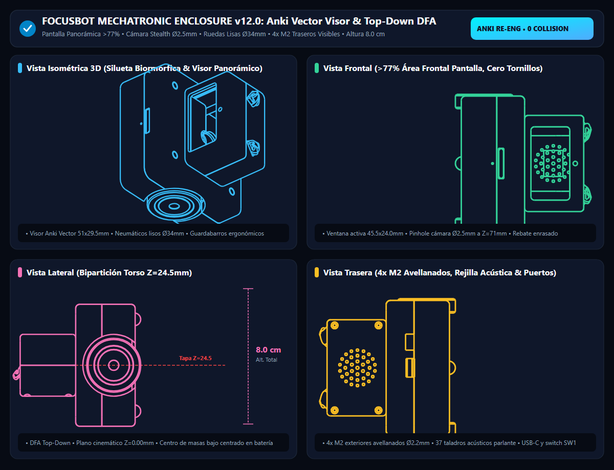
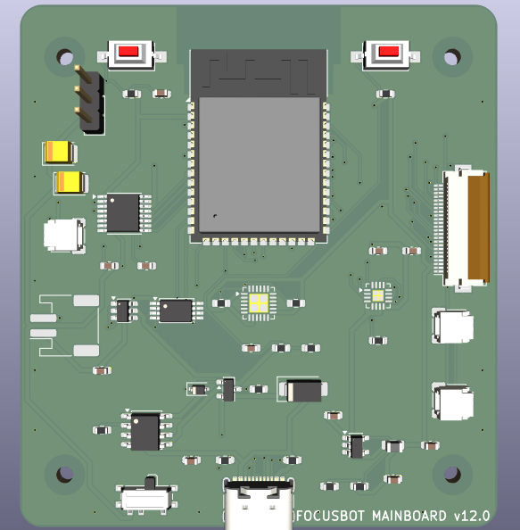
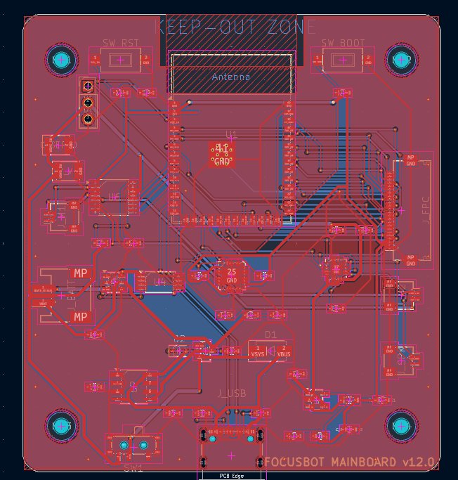
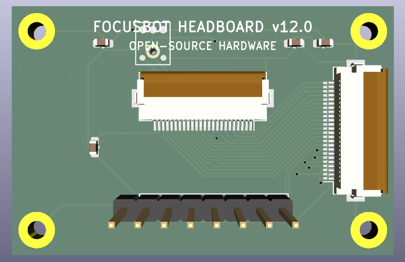
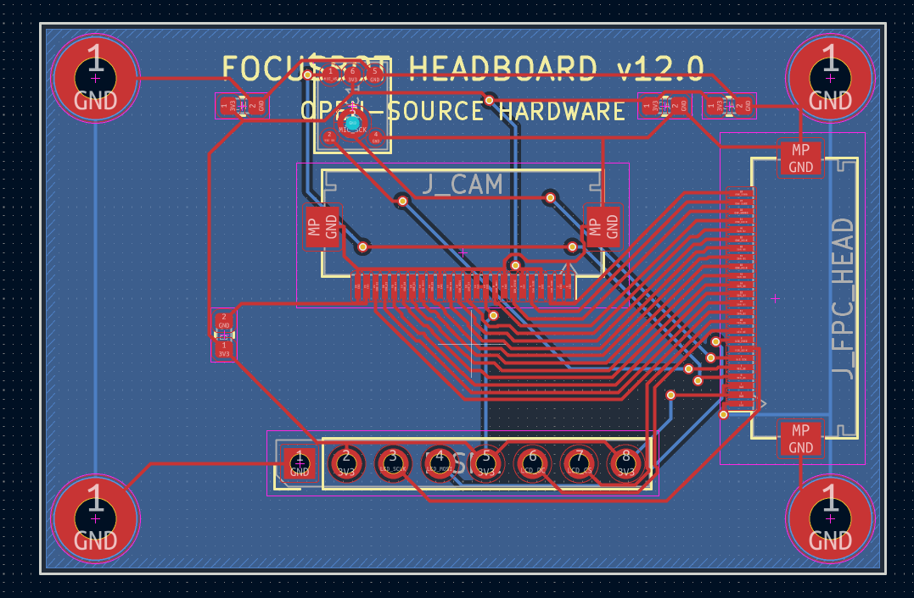
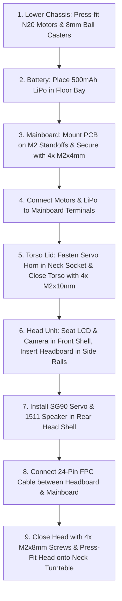

# FOCUSBOT: Open-Source Autonomous AI Desktop Companion Robot

<p align="center">
  
</p>

<p align="center">
  <a href="https://ohwr.org/cern_ohl_s_v2.txt"></a>
  <a href="LICENSE"></a>
  
  <a href="https://www.freecad.org/"></a>
  <a href="https://www.kicad.org/"></a>
  <a href="https://www.espressif.com/"></a>
</p>

---

## 📖 Overview

**FocusBot** is an ultra-compact, expressive, open-source desktop AI companion robot engineered for productivity, computer vision, focus coaching, and interactive robotics research. Built from the ground up under strict industrial mechatronic design standards (*Physics-First, Holistic DFA/DFM, Zero-Collision Solid Geometry*), FocusBot integrates autonomous spatial locomotion, computer vision, two-way digital audio, and expressive screen feedback into an ultra-portable **8.0 cm** form factor.

FocusBot is **100% Open Source Hardware & Software**, designed for accessible manufacturing via standard consumer 3D printers (FDM/SLA) and 2-layer standard PCB fabrication (JLCPCB, PCBWay).

---

## 📐 Mechanical Architecture & DFA Enclosure

FocusBot features a custom **Top-Down DFA (Design for Assembly)** monocoque architecture engineered in FreeCAD with parametric Open CASCADE solid modeling:

<p align="center">
  
</p>

### Key Enclosure Features:
- **Monolithic Unified Face Shell (Integrated Visor & 77% Screen Coverage)**: The front head casing (`Carcasa_Cabeza_Frontal`) is engineered as a 100% monolithic unified solid. Eliminates separate insertable visor plates, perimeter tolerance gaps, and corner seams. Directly integrates a $43.5 \times 23.0\text{ mm}$ viewing window ($R=2.0\text{ mm}$ rounded corners) and a coaxial $\varnothing 2.6\text{ mm}$ stealth pinhole camera aperture, framing the ST7789V 2.0" display cleanly with zero assembly defects.
- **Multi-Tier Zero-Collision Head Packaging (ST7789V 2.0" Bare Panel + OV2640 Stealth Camera)**: Dedicated lower screen cradle ($45.0 \times 2.0 \times 24.5\text{ mm}$) with $43.5 \times 23.0\text{ mm}$ viewing window tailored specifically for the **ST7789V 2.0" IPS TFT bare panel display** (320x240 RGB, glass dimensions $44.5 \times 24.2 \times 1.6\text{ mm}$) at $Z \in [44.5, 69.0\text{ mm}]$; dedicated upper camera pocket ($8.5 \times 3.0 \times 6.5\text{ mm}$) with $\varnothing 2.6\text{ mm}$ stealth pinhole aperture at $Z = 71.0\text{ mm}$ separated by a solid $0.2\text{ mm}$ shelf; 1511 speaker pocket in rear wall; SG90 pan servo in rear cavity; and vertical guide rails for the $46.0 \times 30.0\text{ mm}$ Headboard PCB.
- **Decoupled Interior Fasteners (Zero Front Seams & Zero Broken Bosses)**: 100% clean front facade. 4 rear-accessible M2 counterbored screws clamp into reinforced, fully closed 360° interior bosses ($X = \pm 25.2\text{ mm}$, $Z = 45.5\text{ mm}$ and $71.5\text{ mm}$) embedded inside the solid side walls, completely eliminating C-channel slits and clearing faceplate optics.
- **Top-Down Serviceability & Unified Fastening**: The torso is split horizontally at $Z = 24.5\text{ mm}$ into a lower chassis tub (`Carcasa_Torso_Chasis`) and an upper hood (`Carcasa_Torso_Tapa`). Technicians can populate motors, battery, casters, and wire the Mainboard PCB with complete top-down clearance. 4 vertical M2 fasteners pass through the upper hood and through the Mainboard mounting holes MH1-MH4 ($X = \pm 26.0\text{ mm}$, $Y = \pm 28.0\text{ mm}$), clamping both the PCB and the enclosure together with zero mutual collisions.
- **Kinematic Ground Plane ($Z = 0.00\text{ mm}$)**: 4-point coplanar ground contact consisting of two $\varnothing 34.0\text{ mm}$ smooth cylindrical traction wheels ($R = 17.00\text{ mm}$) and two precision $\varnothing 8.0\text{ mm}$ omnidirectional stainless steel ball casters, guaranteeing zero-wobble differential steering.
- **Zero Collision Guarantee**: 100% verified via boolean intersection algorithms across all 22 solid parts ($0.0000\text{ mm}^3$ mutual collision).

---

## ⚡ Electrical Architecture & PCB Engineering

The robot is powered by a modular two-board architecture communicating through a 24-conductor, 0.5 mm pitch flexible flat cable (FFC/FPC) with locking ZIF connectors:

### 1. Mainboard PCB (`64.0 x 70.0 mm`, 2-Layer FR4)
Acts as the central power, locomotion, and processing hub located in the lower chassis.

<p align="center">
  &nbsp;&nbsp;&nbsp;&nbsp;
  
</p>

- **Microcontroller**: ESP32-S3-WROOM-1 (Dual-core 240 MHz Xtensa LX7, 16 MB Flash, 8 MB Octal PSRAM, Wi-Fi 4, BLE 5.0).
- **Power Subsystem**: Single-cell LiPo 3.7V / 500mAh battery, integrated TP4056 linear charger with USB-C 16-pin interface, DW01A + FS8205A battery protection, and high-efficiency SY8089 buck converter.
- **Motor Control**: Texas Instruments DRV8833 dual H-bridge motor driver (PWM control, forward/reverse/brake) operating at 20 kHz (ultrasonic, zero audible coil whine).
- **Expansion & Diagnostics**: USB-C Native D+/D- USB serial/JTAG for high-speed flashing and debugging without external programmers.
- **Antenna Keepout Zone**: Strict RF isolation zone complying 100% with Espressif hardware design guidelines (0 copper, 0 tracks, 0 vias inside antenna radiation perimeter).

---

### 2. Headboard PCB (`46.0 x 30.0 mm`, 2-Layer FR4)
Acts as the sensory and perceptual face of FocusBot, mounted vertically inside the head unit.

<p align="center">
  &nbsp;&nbsp;&nbsp;&nbsp;
  
</p>

- **Visual Interface**: 2.0" IPS LCD display panel (**ST7789V / NV3022B bare panel**, 320x240 RGB, 4-wire SPI 3.3V, glass $44.5 \times 24.2 \times 1.6\text{ mm}$, active area $40.8 \times 23.0\text{ mm}$) with 77% face area coverage for expressive procedural eye animation rendering.
- **Vision Subsystem**: OV2640 2.0 Megapixel camera module interface for real-time edge AI vision and anti-procrastination monitoring.
- **Audio Output**: Maxim Integrated MAX98357A I2S Class D audio amplifier delivering into a 1511 box speaker with an acoustic compression cavity.
- **Audio Input**: INMP441 high-precision omnidirectional I2S MEMS microphone for voice commands, wake-word detection, and head-tap petting detection.
- **Pan Turntable Actuator**: Drive port for SG90 micro servo mounted inside the head, engaging the torso neck horn for smooth horizontal scanning.

---

## 💻 Production Firmware Architecture ([`firmware/`](firmware/))

FocusBot runs a production-grade C++/Arduino ESP32 firmware configured in PlatformIO with modular architecture:

### 1. Modos de Operación
* **Wake-Up & Self-Test:** Al conectar la alimentación, FocusBot ejecuta un diagnóstico en pantalla ST7789 comprobando la cámara OV2640, audio I2S, micrófono MEMS, motores DRV8833, servo SG90 y batería LiPo. Al finalizar con éxito, reproduce un acorde armónico ascendente C5-E5-G5-C6 y abre los ojos gradualmente.
* **Default Mode (Exploración):** Paseo autónomo por el escritorio con motores controlados por PWM a 20 kHz (inaudibles), movimientos curiosos de cabeza y parpadeo procedural con sacadas de mirada.
* **Focus Mode (IA Anti-Procrastinación):** Monitoreo continuo mediante visión artificial. Si el usuario se levanta o mira el celular constantemente, FocusBot emite una alarma sonora y pone carita de disgusto/alerta, registrando el tiempo productivo (*Focus Score*).
* **LLM Companion (App Móvil):** Servicio BLE GATT para conectar con la app móvil (iOS/Android), permitiendo entablar conversaciones de voz mediante modelos de lenguaje (OpenAI ChatGPT, Google Gemini, Anthropic Claude).
* **Micro-Features:** Sensor acústico de caricias (*Head-Tap Petting*): al tocar suavemente su cabeza, FocusBot responde con ojos de corazón (`EXPR_HEART`) y ronroneo sintetizado (`SND_PETTED_PURR`).

### 2. Flasheo del Microcontrolador
> [!IMPORTANT]
> **El firmware se sube DESPUÉS de soldar.**
> El ESP32-S3 integra USB nativo en silicio (`GPIO19: D-`, `GPIO20: D+`) ruteado directamente al puerto USB-C de la placa principal. No requiere programadores externos ni zócalos especiales: solo conecta el cable USB-C a la PC y ejecuta:
> ```bash
> cd firmware
> pio run -t upload
> ```

---

## 🖨️ 3D Printing & Manufacturing Guide

All printable components are pre-oriented with their flat mating face on the build plate ($Z_{min} = 0.00\text{ mm}$) and centered at $(0, 0)$ for **support-free, 1-click slicing**.

### Slicer Settings (FDM / SLA):
- **Layer Height**: 0.16 mm (0.12 mm recommended for `Visor_Frontal` and `Aros_Cyan`).
- **Wall Thickness**: 4 perimeters (min 1.6 mm) for solid screw boss threads and motor saddles.
- **Infill**: 20% - 25% Gyroid or Honeycomb.
- **Supports**: **Disabled (None required)** when printed in the provided orientations.
- **Bed Temperature**: 60°C (PLA) / 75°C (PETG).
- **Nozzle Temperature**: 210°C (PLA) / 240°C (PETG).

### File Structure in [`cad/3d_print_ready/`](cad/3d_print_ready/):
```text
cad/3d_print_ready/
├── 01_Cuerpo_Blanco_Crema_PLA/   # Main structural housing (Head & Torso)
├── 02_Visor_Negro_PLA/           # High-contrast screen bezel
├── 03_Ruedas_Traccion_TPU_o_PLA/ # High-grip drive wheels
├── 04_Acentos_Cyan_PLA/          # Aesthetic wheel ring accents
├── 05_Difusor_Transluz_PETG/     # Optical chest LED diffuser
├── todos_los_step/               # Precision STEP NURBS models (Bambu / Prusa / Orca)
├── todos_los_stl/                # Individual binary STLs
└── Plato_Completo_220x220mm.stl  # Full robot batch print bed (1.07 MB)
```

---

## 📋 Comprehensive Bill of Materials (BOM)

### Electronics & Actuators
| Ref | Component | Description | Quantity | Package / Footprint |
| :--- | :--- | :--- | :---: | :--- |
| **U1** | ESP32-S3-WROOM-1 | Dual-Core 240MHz MCU, 16MB Flash, 8MB PSRAM | 1 | SMD Module |
| **U6** | DRV8833PWP | Dual H-Bridge Motor Driver (1.5A RMS / 2A Peak) | 1 | HTSSOP-16 |
| **U2** | TP4056 | 1A Standalone LiPo Linear Battery Charger | 1 | SOP-8-PP |
| **U3/U4** | DW01A + FS8205A | LiPo Battery Overcharge/Overdischarge Protection | 1 | SOT-23-6 / TSSOP-8 |
| **U5** | SY8089AAAC | High-Efficiency 2A Synchronous Step-Down Regulator | 1 | SOT-23-5 |
| **U7** | MAX98357A | 3.2W I2S Class D Audio Amplifier | 1 | QFN-16 |
| **U8** | MPU-6050 | 6-DOF Inertial Measurement Unit (Gyro + Accel) | 1 | QFN-24 |
| **M1, M2** | N20 Motors | Micro Metal DC Gearmotor, 6V 300RPM (1:100), D-shaft | 2 | N20 Standard |
| **SRV1** | SG90 / MG90S | 9g Micro Servo Motor (Pan Axis) | 1 | Custom Head Pocket |
| **DISP1**| ST7789 2.0" IPS | 2.0 inch LCD Display Module, 240x320 SPI | 1 | Flush Front Bezel |
| **CAM1** | OV2640 Camera | 2MP DVP Camera Sensor Module | 1 | Coaxial Retention |
| **MIC1** | INMP441 | I2S Omnidirectional MEMS Microphone | 1 | Bottom Acoustic Port |
| **SPK1** | 1511 Speaker | 8 Ohm 1W Miniature Box Speaker (15x11x3.5 mm) | 1 | Head Grille Cavity |
| **BAT1** | LiPo 1S 3.7V | Rechargeable Lithium Polymer Battery (500mAh) | 1 | 38x20x7 mm Base Bay |
| **J_USB** | USB-C Receptacle | USB Type-C 16-Pin Mid-Mount / SMD (Power & JTAG) | 1 | USB-C 16P |

### Hardware & Fasteners
| Type | Specification | Usage | Quantity |
| :--- | :--- | :--- | :---: |
| **Screw M2** | M2 x 8 mm Socket Head Cap Screw | Head Shell Closure (Rear counterbores) | 4 |
| **Screw M2** | M2 x 10 mm Socket Head Cap Screw | Torso Chassis Base to Lid Closure | 4 |
| **Screw M2** | M2 x 4 mm Pan Head Machine Screw | Mainboard PCB Mount Standoffs | 4 |
| **Screw M1.7**| M1.7 x 4 mm Self-tapping Screw | SG90 Servo Mounting Flanges | 2 |
| **Ball Caster**| $\varnothing 8.0\text{ mm}$ Stainless Steel Ball | Front & Rear Omnidirectional Casters | 2 |
| **FFC Cable**| 24-Pin 0.5mm Pitch Flat Cable (100mm) | Torso-to-Head High-Speed Interconnect | 1 |

---

## 🛠️ Assembly Instructions (DFA Workflow)



---

## 🌐 Open Source & Community

FocusBot is an open-source hardware (OSHW) and software project licensed under:
- **Hardware**: [CERN-OHL-S v2 (Strongly Reciprocal)](https://ohwr.org/cern_ohl_s_v2.txt)
- **Firmware & Software**: [MIT License](LICENSE)
- **Documentation & Graphics**: [CC BY-SA 4.0](https://creativecommons.org/licenses/by-sa/4.0/)

We welcome contributions! Whether you are improving PCB layout, adding ROS2 / Micro-ROS firmware support, training computer vision edge models, or designing custom accessories, feel free to open an issue or submit a pull request.

---

<p align="center">
  <b>Engineered with precision for the open-source robotics community.</b><br>
  <sub>Maintained by 8aChristian and contributors.</sub>
</p>
